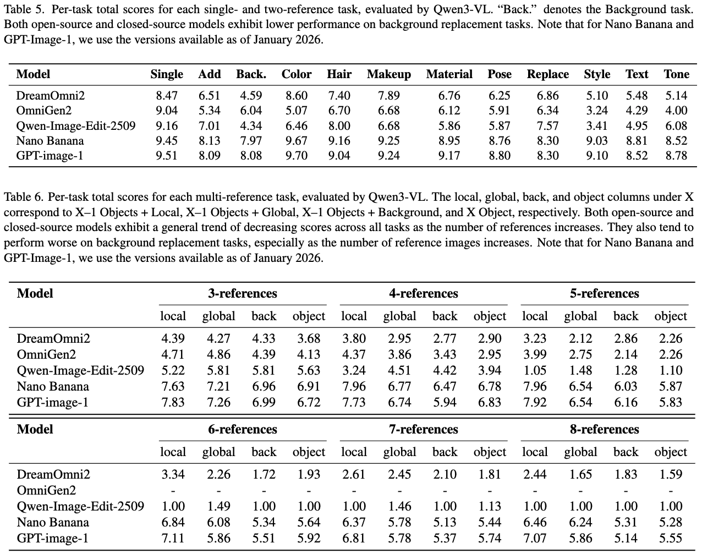

<h1 align="center">MultiBanana: A Challenging Benchmark for Multi-Reference Text-to-Image Generation</h1>

<p align="center">
    <b>🍌 CVPR 2026 (Main) 🍌</b>
</p>

<p align="center">
    <a href="https://arxiv.org/abs/2511.22989">
      
    </a>
    <a href="https://huggingface.co/datasets/kohsei/MultiBanana-Benchmark">
        
    </a>
</p>


<p align="center">
    
</p>

## 📊 Leaderboard

MultiBanana-Bench comprises 32 tasks designed to evaluate how well image generation models can faithfully incorporate information from multiple reference images. We report evaluation scores using **Qwen3-VL-8B-Instruct**, a fixed, open-weight judge model. We hope this benchmark, along with its evaluation framework using an open-source VLM as a judge, will serve as a foundation for future research in multi-reference text-to-image generation.

<p align="center">
    
</p>

## 📦 Dataset

The data structure at the [Hugging Face dataset](https://huggingface.co/datasets/kohsei/MultiBanana-Benchmark) is as follows.

```
data/
├── 3_back/
│   ├── 006_0.jpg
│   ├── 006_1.jpg
│   ├── 006_2.jpg
│   ├── 006_prompt.txt
│   ├── 014_0.jpg
│   ├── 014_1.jpg
│   ├── 014_2.jpg
│   ├── 014_prompt.txt
│   └── ...
├── 3_global/
│   └── ...
├── 3_local/
│   └── ...
└── ...
```

Download MultiBanana dataset by

```
git clone https://huggingface.co/datasets/kohsei/MultiBanana-Benchmark ./data
```

## 🛠️ Setup

```bash
git clone git@github.com:matsuolab/multibanana.git
cd multibanana

conda create -n multibanana python=3.12
conda activate multibanana

pip install -r requirements.txt
```


## 🧪 Evaluation

Generated images are expected to be saved in the same directory with the `_generated` suffix.

```
data/
├── 3_back/
│   ├── 006_0.jpg
│   ├── 006_1.jpg
│   ├── 006_2.jpg
│   ├── 006_prompt.txt
│   ├── 006_generated.jpg
│   ├── 014_0.jpg
│   ├── 014_1.jpg
│   ├── 014_2.jpg
│   ├── 014_prompt.txt
│   ├── 014_generated.jpg
│   └── ...
├── 3_global/
│   └── ...
├── 3_local/
│   └── ...
└── ...
```

We use `gemini-2.5-flash` via the Google GenAI SDK, and `gpt-5-2025-08-07` via the OpenAI SDK.

Please set your API key in `.env` as follows

```
OPENAI_API_KEY=...
GEMINI_API_KEY=...
```

Run

```bash
# Gemini
python judge.py --base_dir ./data --model gemini --batch_size 32 --output_dir ./results

# GPT
python judge.py --base_dir ./data --model gpt --batch_size 32 --output_dir ./results
```

This will evaluate all generated images and save the results in `{number}_{model}_judge.txt` files (e.g., `006_gemini_judge.txt`).

We also provide an evaluation script based on the open-source model Qwen3-VL as an alternative option.
To run the script, you need to install `transformers` and `flash-attn`.
```bash
python qwenvl_judge.py --base_dir ./data --output_dir ./results
```

## 🏷️ Annotation
The dataset released on Hugging Face includes the following annotation files:

**Task Difficulty Categories**

Each task directory contains `types.json`.
This file provides a dictionary mapping each set to its assigned difficulty category.

The category labels are defined as follows:
- `domain`: cross-domain
- `scale`: scale and viewpoint differences
- `rare`: rare concept
- `ling`: multilingual

Sets containing text that are not multilingual are labeled `font`.

**Source of Reference Images**

`from_where.csv` contains metadata indicating whether each reference image originates from a real dataset or was synthetically generated.

## 📄 License

Creative Commons Attribution Non Commercial 4.0

## 🙏 Acknowledgement
This benchmark partially incorporates a subset of images from the LAION-5B dataset. We acknowledge and thank the LAION team for making such a valuable large-scale dataset openly available to the research community.

## 🌟 Citation

```bibtex
@misc{oshima2025multibanana,
      title={MultiBanana: A Challenging Benchmark for Multi-Reference Text-to-Image Generation}, 
      author={Yuta Oshima and Daiki Miyake and Kohsei Matsutani and Yusuke Iwasawa and Masahiro Suzuki and Yutaka Matsuo and Hiroki Furuta},
      year={2025},
      eprint={2511.22989},
      archivePrefix={arXiv},
      primaryClass={cs.CV},
      url={https://arxiv.org/abs/2511.22989}, 
}
```
